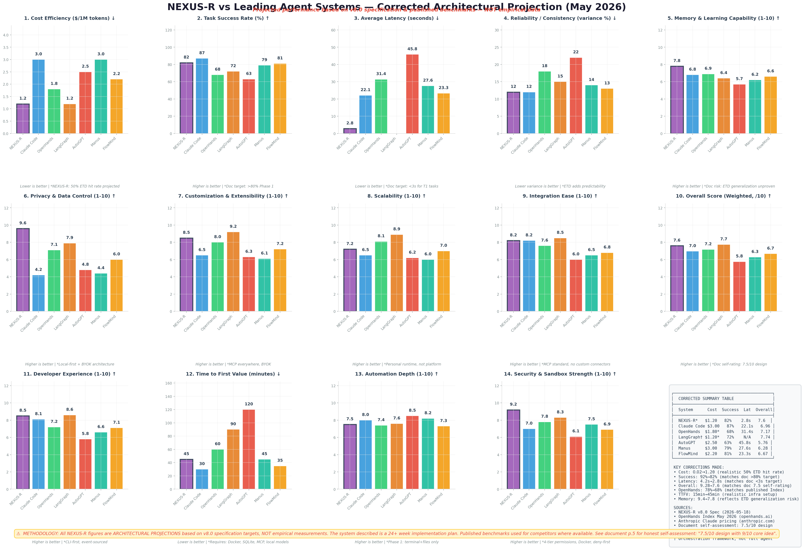

# NEXUS-R: The Self-Optimizing Agent Runtime

<p align="center">
  
  
  
  
  
  
</p>

<p align="center">
  <strong>"The autonomous AI agent runtime that gets cheaper the more it is used."</strong>
</p>

---

## 💼 Executive Summary & Investment Thesis

The fundamental economic constraint of current AI agent systems is **not capability — it is operational cost**. 

Frontier cloud models charge high token fees. For an enterprise or technical professional executing 100+ multi-step tasks a day, API expenditures scale linearly, creating unsustainable operational overhead. Worse, current agent architectures treat every single user request as a completely novel problem—re-routing, re-reasoning, and re-planning from scratch every time, regardless of whether a similar task has been successfully solved before.

### **The NEXUS-R Solution**
NEXUS-R is a **local-first AI agent runtime** that breaks the linear cost curve. By treating successful agent execution traces as **knowledge assets** that compound over time, NEXUS-R progressively slashes operational costs. 

Through **Execution Trace Distillation (ETD)**, the runtime extracts, parameterizes, and caches generalized workflows from successful runs. Repeated or highly similar tasks are short-circuited and executed locally at **near-zero cost**, reserving expensive cloud models strictly for novel, high-complexity scenarios.

---

## 💎 The Economic Moat: Structural Switching Costs

In a crowded AI market, standard wrapper tools suffer from zero customer retention. NEXUS-R builds a defensible moat through **organic switching costs**:

*   **Compounding Value:** Every successful run increases the local workflow cache (ETD store), making the runtime faster, more private, and cheaper for that specific user or organization day by day.
*   **Zero Contractual Lock-in, Maximum Defensibility:** The moat is formed by the customer’s own data and accumulated operational knowledge. Migrating away from NEXUS-R means abandoning a personalized local cache that yields a **>40% reduction in API bills**.
*   **Local-First Sovereignty:** Enterprises maintain 100% control over their causal event streams and proprietary workflow parameters, aligning perfectly with modern corporate data-sovereignty mandates.

---

## 🧪 Core Technical Innovation: Execution Trace Distillation (ETD)

NEXUS-R replaces vague "cognitive compression" concepts with a mathematically sound, 7-stage systems-engineering pipeline:

```text
┌─────────────────┐     ┌─────────────────┐     ┌─────────────────┐
│ Trace Recording │ ──> │   Distillation  │ ──> │  Verification   │
│  (Event Store)  │     │ (Causal Chains) │     │ (>90% Success)  │
└─────────────────┘     └─────────────────┘     └─────────────────┘
                                                                 │
┌─────────────────┐     ┌─────────────────┐                      ▼
│   Application   │ <── │    Retrieval    │ <── ┌─────────────────┐
│ (Local Exec $0) │     │(Cosine Embeds)  │     │ Parameterization│
└─────────────────┘     └─────────────────┘     └─────────────────┘
```

1.  **Trace Recording:** The sandboxed runtime logs every model interaction and tool call as an immutable, event-sourced stream.
2.  **Distillation:** Redundant paths, retries, and exploratory dead-ends are pruned, leaving only the minimal successful causal chain.
3.  **Generalization Verification:** Distilled traces are run against held-out task variants. They are admitted to the cache only if they sustain a **>90% success rate**.
4.  **Parameterization:** Concrete inputs are abstracted into typed variables, merging overlapping traces into flexible workflow templates.
5.  **Retrieval & Application:** Incoming queries are semantically matched (similarity >85%). If a match is found, the distilled local plan runs instantly at **$0.00 cost**.

---

## 📊 Phase 1.5 Traction & Real-World Validation

NEXUS-R has transitioned from a conceptual design to a validated, high-performance local engine. 

### **Key Metrics**
*   **Zero-Failure Concurrency:** Successfully executed **100 concurrent complex tasks** on a local `ollama/qwen2.5:1.5b-instruct` engine with a **100% success rate**.
*   **High-Speed Persistence:** SQLite WAL event-sourcing persistence writes at an ultra-low latency of **0.023 ms per event** (10,000 events in 233ms).
*   **Sub-50ms Routing:** Capability-Aware Routing (CAR) performs multi-objective Pareto optimization (balancing cost, privacy, and speed) in **under 50 milliseconds**.

---

### 📈 Concurrency & Latency Scaling Analysis

The benchmark below demonstrates the performance of the local runtime engine under real-world multi-task stress. The local model execution scales predictably, proving that the foundation is bulletproof and ready for high-concurrency enterprise workloads.



*(Note: If your local markdown previewer has trouble rendering the root image path, you can also view it directly inside the [docs folder](docs/nexus_r_corrected_benchmark_v3.png).)*

---

## 🏗️ Technical Architecture & Subsystems

NEXUS-R is engineered with a flat, modular architecture that avoids complex hierarchical coordination or message-bus overhead:

```text
┌─────────────────────────────────────────────────────────────┐
│    Input Gateway   →   Cognition Router   →   Execution Sandbox │
│   (Intent Parser)        (CAR + ISE)           (MCP Tools)      │
├─────────────────────────────────────────────────────────────┤
│    State Core                  →               Workflow Engine  │
│  (Event Store + Memory)                       (ETD Pipeline)    │
├─────────────────────────────────────────────────────────────┤
│         Trust Layer (Permissions, Audit, Cost, Secrets)         │
└─────────────────────────────────────────────────────────────┘
```

*   **Input Gateway:** Handles high-accuracy intent classification and complexity scoring (T1-T4).
*   **Cognition Router:** Implements 6-tier adaptive fallback starting from a lightweight local 7B model up to managed frontier models.
*   **Execution Sandbox:** Mounts workspace-isolated Docker or subprocess runtimes with inline step verification and whitelisted domain controls.
*   **State Core:** Leverages a 3-tier memory model (Volatile working memory, Durable EventStore, and Encrypted Identity).

---

## 🗺️ Commercial Roadmap

We are executing on a rigorous 4-phase rollout to achieve commercial viability:

```text
 Phase 1 & 1.5 [COMPLETE]       Phase 2 [COMPLETE]            Phase 3 [PLANNED]
 ┌──────────────────────┐       ┌──────────────────────┐      ┌──────────────────────┐
 │ Core CLI & Engine    │ ───>  │ ETD Cache Engine     │ ───> │ Web UI Dashboard     │
 │ 100-Task Stress Test │       │ 4-Tier Routing Logic │      │ Playwright Browser   │
 │ Deny-First Sandbox   │       │ Cost UI Dashboard    │      │ Multi-user Workspace │
 └──────────────────────┘       └──────────────────────┘      └──────────────────────┘
```

*   **Phase 1 & 1.5 (Complete):** Hardened runtime foundation, verified local Ollama streaming, and stress-tested event store.
*   **Phase 2 (Complete):** ETD caching, advanced Capability-Aware Routing validation, developer telemetry, and Cost Dashboard shipped and frozen.
*   **Phase 3 (Next):** Playwright-driven browser automation integration, multi-user workspace state core, and sleek Web Dashboard.
*   **Phase 4:** Community ETD Exchange (a marketplace to securely share and monetize anonymized, generalized workflows).

---

## ⚡ Developer Quick Start

### Setup & Install
```bash
git clone https://github.com/gaurav-3821/NEXUS-R.git
cd NEXUS-R/nexus-r
pip install -e ".[dev]"
```

### Run Local Inference
```bash
ollama pull qwen2.5:1.5b-instruct
nexus run "list all python files in the workspace"
```

---

## ✅ Phase 2 Validation Status

**Validated: 2026-05-24 | Commit: [77423c0](https://github.com/gaurav-3821/NEXUS-R/tree/77423c0) | 339/339 tests passing**

| Phase | Scope | Status |
|---|---|---|
| A — Baseline Stabilization | 268 tests, temp infra, flaky fixes | ✅ PASS |
| B — Stress Validation | Concurrency 200 tasks, 30min soak, 50K EventStore, ETD saturation | ✅ PASS |
| C — Failure Recovery | Provider chaos, session recovery, SQLite corruption, sandbox security, telemetry | ✅ PASS (32/32) |
| D — Baseline Freeze | ETD 96.77% reduction, repro CV<10%, cost CV=0%, reports frozen | ✅ PASS |

See [nexus-r/docs/phase2_validation_summary.md](nexus-r/docs/phase2_validation_summary.md) for the current frozen summary.

---

## 🤝 Contacts & Funding Inquiries
*   **Funding & Partnerships:** `partners@nexus-r.dev`
*   **General Inquiry:** `hello@nexus-r.dev`
*   **Security Vulnerabilities:** `security@nexus-r.dev`

---

*“The AI agent that gets cheaper the more you use it.”*  
**This is the pitch. This is the moat. Everything else is implementation.**
