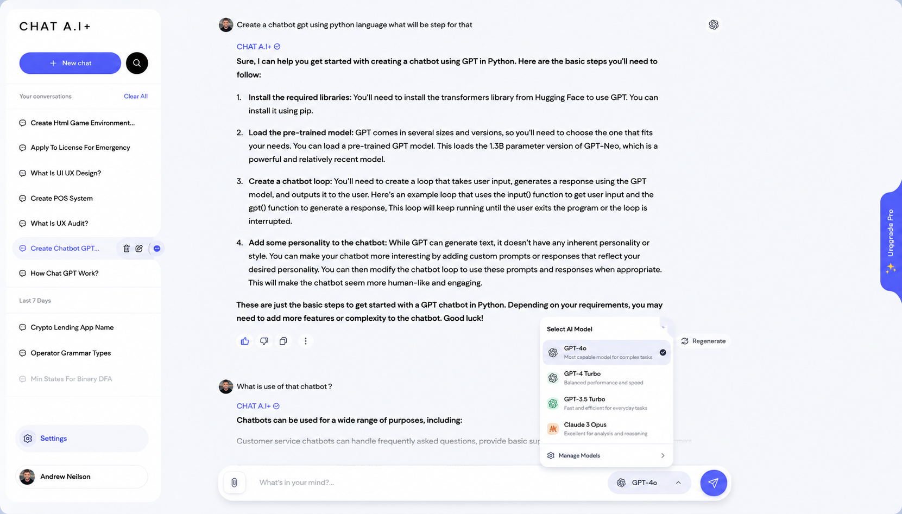
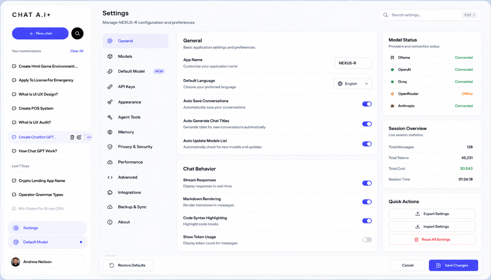
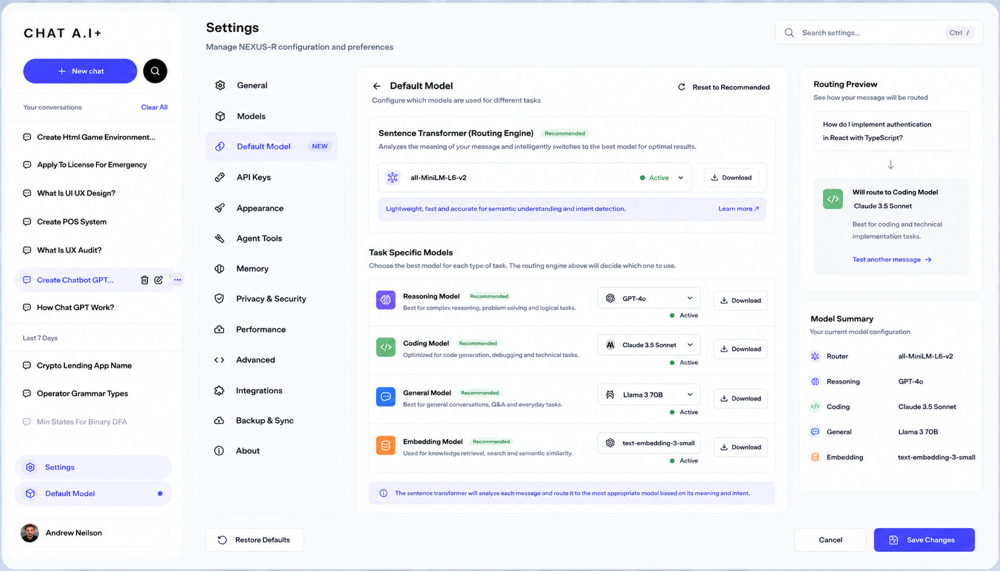

<div align="center">
  <br/>
  
  <br/><br/>
  <h1>NEXUS-R</h1>
  <h3>The open-source AI agent runtime that puts <em>you</em> in control</h3>
  <p align="center">
    <strong>Local-first · Multi-provider · Auditable · Cost-optimized</strong>
  </p>
  <p>
    <a href="https://github.com/gaurav-3821/NEXUS-R/actions/workflows/ci.yml">
      
    </a>
    
    
    
    
  </p>
</div>

---

## What is NEXUS-R?

NEXUS-R is a **local-first agent runtime** that intelligently routes AI tasks across 10+ providers — from local models on your machine to cloud APIs — under a single, auditable policy.

**One command to start:**
```bash
git clone https://github.com/gaurav-3821/NEXUS-R.git && cd NEXUS-R && make docker-up
# Open http://localhost:3000
```

---

## At a Glance: Every Feature

| Category | Feature | What It Does |
|----------|---------|--------------|
| **🤖 Multi-Provider** | 10+ AI providers | Ollama, OpenAI, Anthropic, OpenRouter, Groq, Cohere, Mistral, Google, Together AI |
| **🧠 Smart Routing** | Auto-classification | `route_query()` classifies every task in under 1ms — keyword + semantic analysis |
| **🔒 Permission Tiers** | T1–T5 escalation | Trivial → Coding → Standard → Complex → Requires Approval |
| **🔐 BYOK** | Bring Your Own Key | Use your existing API keys. NEXUS-R never stores them. |
| **🏠 Local-First** | Privacy by default | Simple tasks stay on your machine. Cloud is opt-in per task. |
| **📊 Web Dashboard** | Real-time UI | React 19 + TypeScript dashboard with live streaming, model management |
| **💾 Persistent Memory** | SQLite + Vectors | Conversation history with ChromaDB semantic search |
| **📝 Audit Trail** | Append-only log | Every routing decision recorded — you see *why* a model was chosen |
| **📦 Docker Deploy** | One-liner | Full stack: backend + frontend + ChromaDB via Docker Compose |
| **💵 Cost Tracking** | Per-task visibility | See estimated cost before execution, actual cost after |
| **🎨 Theme System** | Dark mode + accents | Light/dark with customizable accent colors |

---

## The Problem It Solves

| Approach | Privacy | Model Quality | Setup Time | Routing |
|----------|---------|---------------|------------|---------|
| **Cloud-only** (OpenAI, Claude) | ❌ Data leaves your machine | ✅ Best-in-class | ✅ API key → go | ❌ None |
| **Local-only** (Ollama, llama.cpp) | ✅ Fully private | ⚠️ Smaller models | ⚠️ Needs GPU/RAM | ❌ None |
| **Frameworks** (LangChain, AutoGPT) | ⚠️ Config-dependent | ✅ Multi-model | ❌ Hours of setup | ⚠️ Manual |
| **NEXUS-R** | ✅ **Stays local by default** | ✅ **10+ providers** | ✅ **5-minute setup** | ✅ **Automatic** |

**No other open-source runtime** lets you seamlessly blend local and cloud models with full audit, cost tracking, and a built-in dashboard — all out of the box.

---

## How It Works

```
Your Task ("Analyze this CSV")
       │
       ▼
  ┌──────────────────────┐
  │   Input Gateway      │  ← Parses intent, extracts parameters
  └──────────┬───────────┘
             ▼
  ┌──────────────────────┐
  │   Cognition Router   │  ← Classifies task (keyword + semantic)
  │                      │
  │  T1 — Trivial        │ → Local model (instant replies)
  │  T2 — Coding         │ → Local coder model
  │  T3 — Standard       │ → Your cloud provider
  │  T4 — Complex        │ → Premium cloud model
  │  T5 — Critical       │ → Requires explicit approval
  └──────────┬───────────┘
             ▼
  ┌──────────────────────┐
  │   Trust Layer        │  ← Permission check, cost estimate
  └──────────┬───────────┘
             ▼
  ┌──────────────────────┐
  │   Model Execution    │  ← Ollama / OpenAI / Anthropic / etc.
  └──────────┬───────────┘
             ▼
  ┌──────────────────────┐
  │   Audit Log          │  ← Append-only record of everything
  │   + Dashboard        │  ← Real-time visibility into every decision
  └──────────────────────┘
```

---

## Feature Deep-Dive

### 🧠 Cognition Router
The brain of NEXUS-R. Every task is classified in under 1ms using:
- **Keyword matching** — Detects code, math, research, trivial queries instantly
- **Semantic similarity** — Falls back to sentence embeddings for ambiguous queries
- **Provider fallback chain** — If your selected model fails, the next provider is tried automatically

### 🔒 Permission Tiers (T1–T5)
Every action is assigned a tier. You control what each tier can do:
- **T1:** Chat, greetings, simple Q&A — runs locally, no restrictions
- **T2:** Code generation, debugging — routed to coder models
- **T3:** Research, web search — uses cloud providers if configured
- **T4:** System analysis, audits — requires premium model
- **T5:** Destructive operations — must be explicitly approved

### 💾 Memory & Persistence
Two layers working together:
- **SQLite** — Relational storage for conversations, settings, history
- **ChromaDB** — Vector store for semantic memory search ("what did we say about X?")

### 🖥️ Web Dashboard
Built with React 19 + TypeScript + Vite + Tailwind CSS v4:
- Real-time model response streaming
- Conversation history with search
- Model management (view, download, select)
- Cost tracking per conversation
- Theme system (light/dark + accent colors)
- Mobile-responsive layout

---

## Architecture

```
nexus-r/
 foundation/nexus_r/     Core primitives (config, events, errors, telemetry)
 modules/
   cli/                  Command-line interface (Typer)
   cognition_router/     AI model selection and routing
   execution_sandbox/    Confined workspace actions (T1–T5)
   input_gateway/        Task parsing and intent extraction
   orchestrator/         End-to-end pipeline composition
   session_manager/      Crash-safe session checkpoints
   state_core/           Event persistence and projections
   trust_layer/          Permissions, cost tracking, secrets
   web_ui/               FastAPI backend + React dashboard
   workflow_engine/      Causal tracing and workflow storage
 frontend/               React 19 + TypeScript + Vite
 specs/                  Module specifications
```

---

## Comparison with Alternatives

| Feature | **NEXUS-R** | LangChain | AutoGPT | Open Interpreter |
|---------|:-----------:|:---------:|:-------:|:----------------:|
| Local-first routing | **✅ Native** | ❌ Cloud-first | ❌ Cloud-first | ⚠️ Local only |
| Multi-provider | **✅ 10+** | ✅ 10+ | ❌ Single | ❌ Single |
| Auto-routing | **✅ Keyword + semantic** | ❌ Manual | ❌ Fixed | ❌ Fixed |
| Permission tiers | **✅ T1–T5** | ❌ | ❌ | ⚠️ Basic |
| Built-in web dashboard | **✅ Yes** | ❌ Separate | ❌ | ❌ |
| Audit trail | **✅ Append-only** | ❌ | ⚠️ Basic | ❌ |
| Docker one-liner | **✅ Yes** | ❌ Manual | ❌ | ❌ |
| Cost tracking | **✅ Real-time** | ❌ | ❌ | ❌ |
| BYOK support | **✅ Native** | ✅ | ❌ | ❌ |

---

## Tech Stack

| Layer | Technology |
|-------|------------|
| **Runtime** | Python 3.11+, FastAPI, Uvicorn |
| **CLI** | Typer |
| **Frontend** | React 19, TypeScript, Vite 8, Tailwind CSS v4 |
| **State** | Zustand |
| **Database** | SQLite (aiosqlite), ChromaDB (vectors) |
| **AI Routing** | LiteLLM, sentence-transformers |
| **Testing** | pytest, Vitest, Playwright |
| **DevOps** | Docker, GitHub Actions, Ruff, MyPy |

---

## Quick Start

### Docker (recommended)
```bash
make docker-up
# Open http://localhost:3000
```

### Manual setup
```bash
make setup       # Install backend + frontend deps
make run         # Start dev servers
# Open http://localhost:5173
```

### Try the CLI
```bash
cd nexus-r
nexus run "list Python files in this project"
```

---

## Documentation

- [Architecture](ARCHITECTURE.md)
- [Capabilities Deep-Dive](CAPABILITIES.md)
- [Contributing](CONTRIBUTING.md)
- [API Docs](http://localhost:8000/docs) (start backend first)
- [FAQ](docs/FAQ.md)
- [Troubleshooting](docs/TROUBLESHOOTING.md)
- [Changelog](CHANGELOG.md)
- [Roadmap](docs/ROADMAP.md)

---

## Screenshots

<div align="center">
  
  <br/><br/>
  
  <br/><br/>
  
  <br/><br/>
  
</div>

---

## License

[MIT](LICENSE) &copy; 2026 Gaurav Tayde

---

<div align="center">
  <sub>Built in India. Made for the world. 🌏</sub>
</div>
