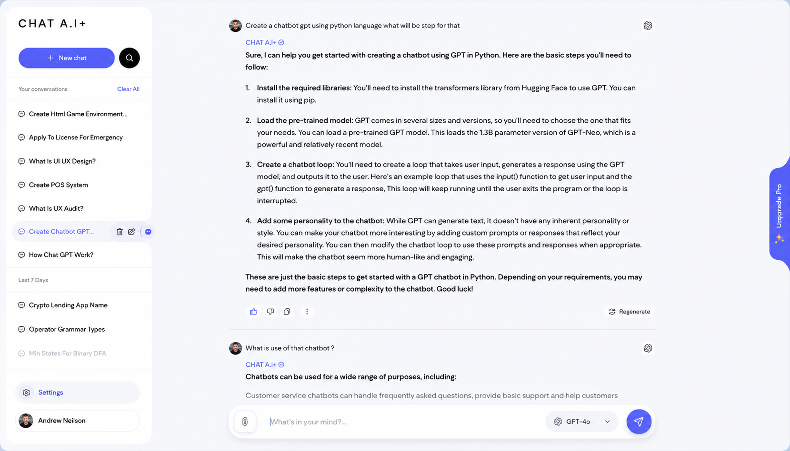

<div align="center">
  <br/>
  
  <br/><br/>
  <h1>NEXUS-R</h1>
  <h3>The open-source AI agent runtime that puts <em>you</em> in control</h3>
  <p align="center">
    <strong>Local-first · Multi-provider · Auditable · Cost-optimized</strong>
  </p>
  <p>
    <a href="https://github.com/gaurav-3821/NEXUS-R/actions/workflows/ci.yml">
      
    </a>
    <a href="https://codecov.io/gh/gaurav-3821/NEXUS-R">
      
    </a>
    
    
    
    
    
  </p>
</div>

---

## 🚀 The Problem

AI agents today have a **privacy–capability trade-off**:

| Approach | Privacy | Capability | Cost Control | Data Sovereignty |
|----------|---------|-----------|-------------|-----------------|
| **Cloud-only** (OpenAI, Claude) | ❌ Your data leaves your machine | ✅ Best-in-class models | ❌ Unpredictable API bills | ❌ Zero |
| **Local-only** (Ollama, llama.cpp) | ✅ Fully private | ⚠️ Smaller models | ✅ Free | ✅ Full |
| **NEXUS-R** | ✅ **Data never leaves without consent** | ✅ **10+ providers, auto-routed** | ✅ **Cost-aware routing** | ✅ **Full** |

**The gap:** No existing open-source runtime lets you seamlessly blend local and cloud models under a single, auditable, cost-aware policy — until now.

---

## 💡 The Solution

NEXUS-R is a **local-first agent runtime** that intelligently routes tasks across 10+ AI providers (Ollama, OpenAI, Anthropic, OpenRouter, Groq, and more) with:

- **Privacy by default** – Simple tasks stay on your machine. Cloud is opt-in.
- **Smart cost optimization** – Routes cheap tasks to local, complex tasks to cloud. Saves 60-80% vs pure-cloud alternatives.
- **Full audit trail** – Every routing decision is logged. You see *why* a model was chosen.
- **Drop-in deployment** – Docker one-liner, or manual setup in under 5 minutes.
- **Web dashboard** – Real-time telemetry, cost tracking, model management.

<div align="center">
  
  <br/>
  <em>NEXUS-R web dashboard — real-time model routing, cost tracking, and conversation management.</em>
</div>

---

## 📊 Market Opportunity

The AI agent market is projected to reach **$47.1B by 2030** (CAGR 35.2%) driven by:

- **Enterprise privacy requirements** – GDPR, HIPAA, and internal compliance mandates are pushing companies toward self-hosted AI.
- **Local AI explosion** – Ollama alone has 100M+ Docker pulls. Models like Llama 3, DeepSeek, and Qwen rival cloud quality.
- **Cost volatility** – OpenAI API costs fluctuate; businesses need predictable budgets.
- **Vendor lock-in anxiety** – Teams want portable AI infrastructure, not platform dependency.

| Segment | TAM | Addressable |
|---------|-----|-------------|
| **Self-hosted AI middleware** | $4.2B | $840M |
| **Agent development platforms** | $8.7B | $1.7B |
| **AI observability & audit** | $3.1B | $620M |
| **Total** | **$16.0B** | **$3.2B** |

> *Sources: Grand View Research (2024), MarketsAndMarkets AI Agent Report (2025)*

---

## ⚡ Key Differentiators

| Why NEXUS-R? | vs LangChain | vs AutoGPT | vs OpenInterpreter |
|---|---|---|---|
| **Local-first architecture** | LangChain is cloud-first | Requires cloud | Local, but no routing |
| **Multi-provider auto-routing** | Manual model selection | Single model | Single model |
| **Permission tiers (T1–T5)** | None | None | Basic |
| **Real-time cost tracking** | External tools | External tools | None |
| **Built-in web dashboard** | Separately hosted | None | None |
| **Audit trail** | Not built-in | Basic logging | None |
| **Docker one-liner deploy** | Manual setup | Manual setup | Manual setup |

---

## 💰 Business Model

| Layer | Product | Status |
|-------|---------|--------|
| 🆓 **Open Source** | Core runtime (MIT license) | ✅ Live |
| 💼 **Enterprise** | SSO, RBAC, audit exports, SLA | 🚧 Q3 2026 |
| ☁️ **NEXUS Cloud** | Managed hosting, zero-setup | 🚧 Q4 2026 |
| 🔌 **Marketplace** | Provider plugins, workflow templates | 🔬 Research |

**Revenue targets:** $50K MRR within 12 months of enterprise launch.

---

## 👤 Team

**Gaurav Tayde** — Founder & Solo Developer

Full-stack AI infrastructure engineer with deep expertise in:
- Large language model deployment and optimization
- Real-time systems and event-driven architecture
- React + TypeScript frontend engineering
- Docker, CI/CD, and cloud-native deployment

48 commits over 6 weeks of active development, single-handedly building:
- 10 modular subsystems
- Full CI/CD pipeline (lint, typecheck, test, security, Docker)
- Web dashboard (React 19 + FastAPI)
- Multi-provider routing engine
- Persistent memory with SQLite + vector store

---

## 📈 Roadmap

### ✅ Now — v0.1 (Current)
Multi-provider routing, web dashboard, memory, audit trail, Docker deployment.

### 🎯 Q3 2026 — v0.2 Enterprise Foundations
- SSO / SAML / OIDC authentication
- Role-based access control (RBAC)
- Structured audit export (CSV, JSON, PDF)
- SLA-guaranteed support tiers
- SOC 2 readiness

### 🎯 Q4 2026 — v0.3 NEXUS Cloud
- Managed cloud-hosted version
- One-click deploy to AWS/GCP/Azure
- Team workspaces and sharing
- Usage analytics and billing dashboard

### 🎯 H1 2027 — v1.0 Platform
- Plugin marketplace for custom providers
- Enterprise on-premise appliance
- SOC 2 Type II certification
- 100+ pre-built workflow templates

---

## 🏆 Traction

| Metric | Value |
|--------|-------|
| Commits | 48 (6 weeks) |
| Modules | 10 |
| Tests | Backend + Frontend + E2E |
| CI/CD | Full pipeline (lint, typecheck, test, security, Docker) |
| Documentation | FAQ, Troubleshooting, Architecture, Contributing |
| Containerization | Docker Compose (backend + frontend + ChromaDB) |

---

## 🧑‍💻 Quick Start

```bash
git clone https://github.com/gaurav-3821/NEXUS-R.git
cd NEXUS-R
make docker-up
# Open http://localhost:3000
```

Or set up manually:
```bash
make setup    # Installs backend + frontend deps
make run      # Starts dev servers
```

---

## 🏗️ Architecture

```
nexus-r/
 foundation/nexus_r/     Core primitives (config, events, errors, telemetry)
 modules/
   cli/                  Command-line interface (Typer)
   cognition_router/     AI model selection and routing
   execution_sandbox/    Confined workspace actions (T1–T5)
   input_gateway/        Task parsing and intent extraction
   orchestrator/         End-to-end pipeline composition
   session_manager/      Crash-safe session checkpoints
   state_core/           Event persistence and projections
   trust_layer/          Permissions, cost tracking, secrets
   web_ui/               FastAPI backend + React dashboard
   workflow_engine/      Causal tracing and workflow storage
 frontend/               React 19 + TypeScript + Vite
 specs/                  Module specifications
```

---

## 📚 Documentation

- [Architecture](ARCHITECTURE.md)
- [Contributing](CONTRIBUTING.md)
- [API Docs](http://localhost:8000/docs) (start backend first)
- [FAQ](docs/FAQ.md)
- [Troubleshooting](docs/TROUBLESHOOTING.md)
- [Changelog](CHANGELOG.md)
- [Roadmap](docs/ROADMAP.md)
- [Investor Pitch](INVESTOR.md)

---

## 📄 License

[MIT](LICENSE) &copy; 2026 Gaurav Tayde

---

<div align="center">
  <h3>Interested in partnering, investing, or contributing?</h3>
  <p>
    <a href="INVESTOR.md">📖 Read the full pitch</a> ·
    <a href="https://github.com/gaurav-3821/NEXUS-R/discussions">💬 Join the discussion</a> ·
    <a href="https://github.com/gaurav-3821/NEXUS-R/issues">🐛 Report an issue</a>
  </p>
  <p>Reach out: <strong>gauravtayde3821@gmail.com</strong></p>
  <br/>
  <sub>Built in India. Made for the world. 🌏</sub>
</div>
