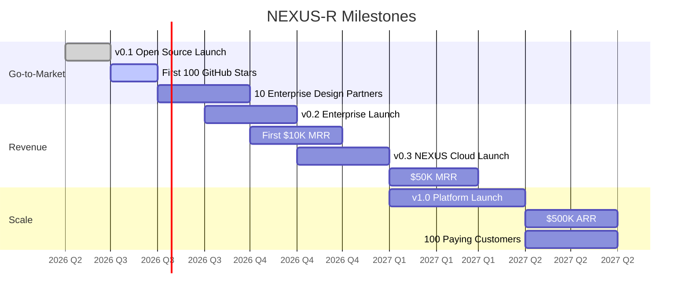

# NEXUS-R Roadmap

## ✅ v0.1 — Foundation (Current)
*June 2026*

**Goal:** Working local-first agent runtime with core routing, UI, and deployment.

- [x] Multi-provider routing (10+ providers)
- [x] Local-first architecture with privacy-by-default
- [x] Web dashboard (React 19 + TypeScript)
- [x] Persistent memory (SQLite + ChromaDB)
- [x] Real-time model streaming
- [x] Permission tiers (T1–T5)
- [x] Audit trail (append-only event log)
- [x] Docker Compose deployment
- [x] CI/CD pipeline (lint, typecheck, test, security, Docker)
- [x] Full documentation (architecture, contributing, FAQ, troubleshooting)

**Business metric:** Functional MVP ready for early adopters.

---

## 🎯 v0.2 — Enterprise Foundations (Q3 2026)

**Goal:** Make NEXUS-R enterprise-ready with auth, compliance, and support.

| Feature | Business Impact |
|---------|----------------|
| SSO / SAML / OIDC | Unlocks enterprise sales |
| Role-based access control (RBAC) | Compliance requirement |
| Structured audit export (CSV, PDF, JSON) | SOC 2 readiness |
| Usage analytics dashboard | Budget planning for teams |
| Priority email support (SLA) | Revenue ($500–5K/mo) |
| Prometheus metrics + Grafana | Operations visibility |
| Health checks + auto-recovery | Production reliability |

**Business metric:** First 10 enterprise design partners signed.

---

## 🎯 v0.3 — NEXUS Cloud (Q4 2026)

**Goal:** Launch managed cloud-hosted version for zero-setup adoption.

| Feature | Business Impact |
|---------|----------------|
| Managed cloud hosting | $50–500/mo subscription revenue |
| One-click deploy to AWS/GCP | Faster enterprise trials |
| Team workspaces | Viral growth within orgs |
| Usage-based billing | Scales with customer success |
| API key management UI | Self-service onboarding |

**Business metric:** $50K MRR from cloud + enterprise subscriptions.

---

## 🎯 v1.0 — Platform (H1 2027)

**Goal:** Become the go-to open-source AI agent platform.

| Feature | Business Impact |
|---------|----------------|
| Plugin marketplace | Community ecosystem, 3rd-party revenue |
| Workflow templates (100+) | Reduces time-to-value |
| Enterprise on-premise appliance | $10K+/mo deals |
| SOC 2 Type II certification | Enterprise procurement requirement |
| Multi-region deployment | Global enterprise readiness |

**Business metric:** $500K ARR, 100+ paying customers.

---

## 🔭 Future Horizons

| Horizon | Product | Revenue Model |
|---------|---------|---------------|
| **H2 2027** | AI agent marketplace (buy/sell agents) | Transaction fee (5%) |
| **2028** | NEXUS-R Enterprise Appliance | Hardware + software bundle ($50K+/yr) |
| **2029** | Fully managed AI infrastructure platform | Consumption-based ($0.01/task) |

---

## ⚡ Key Milestones

---

## 💡 How You Can Help

| Role | Need | Impact |
|------|------|--------|
| **Design partner** | Validate enterprise features | Shape the product roadmap |
| **Contributor** | Provider plugins, docs, tests | Build the ecosystem |
| **Investor** | Seed funding ($250K–$500K) | Accelerate development to 12-month full-time |
| **Advisor** | Go-to-market strategy | Avoid common startup mistakes |

---

*See [INVESTOR.md](../INVESTOR.md) for the full business model and financial projections.*
